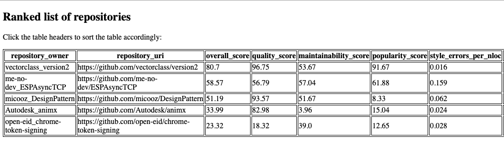

# GitRank: A Framework to Rank Open-source Repositories

GitRank is a Python-based framework to rank open-source repositories on quality, maintainability, and popularity metrics. It considers a number of source code metrics such as code formatting issues, security issues, GitHub stars, watches and forks, etc., to obtain a score for every repository. Given a list of repositories, the scores of all the repositories are then used to rank them.

The framework is developed as a part of [MSR'22 hackathon](https://conf.researchr.org/track/msr-2022/msrhackathon2022) by team MPR from Intel Labs.

# Install

```
$ git clone https://github.com/nirhasabnis/gitrank
$ cd gitrank
$ pip3 install -r base_requirements.txt
$ pip3 uninstall lizard
$ pip3 install -r lizard_requirements.txt
```

Before using the scripts in this repository, please check that following commands work:
```
$ lizard --version
1.17.9

$ scancode --version
ScanCode version 30.1.0 or higher
...

$ cpplint --version
Cpplint fork (https://github.com/cpplint/cpplint)
cpplint 1.5.4 or higher
Python <version> 
...
```

# Usage

GitRank accepts a list of repository URLs as input.

## Phase 1: obtaining code metrics for every repository

Given a list of repository URLs as input, we first obtain source code metrics for all the repositories as follows:
```
$ scripts/get_repo_metadata_in_batch.sh -f quick_test/cpp.list -o cpp.csv -t <github_token>
```

Output file `cpp.csv` should contain information as follows:
```
repository_owner,repository_uri,stargazers_count,subscribers_count,forks_count,open_issues,repo_age_in_days,created_at,num_commits,open_issues_and_pr_now,closed_issues_and_pr_over_two_year,closed_issues_and_pr_over_one_year,closed_issues_and_pr_over_six_months,closed_issues_and_pr_over_one_month,average_cyclomatic_complexity_for_repo,average_maintainability_index_for_repo,style_errors,style_errors_per_nloc,is_valid_license,security_notes,security_warnings,security_errors,security_notes_per_nloc,security_warnings_per_nloc,security_errors_per_nloc
vectorclass_version2,https://github.com/vectorclass/version2,765,42,92,4,909,2019-08-01T10:25:51Z,65,4,38,9,6,0,1.9,111.18,728,0.016,1,4,0,0,0.0,0.0,0.0
micooz_DesignPattern,https://github.com/micooz/DesignPattern,130,10,83,1,2350,2015-08-21T13:54:04Z,17,0,0,0,0,0,1.09,124.2,94,0.062,1,0,0,0,0.0,0.0,0.0
open-eid_chrome-token-signing,https://github.com/open-eid/chrome-token-signing,195,33,82,8,2784,2014-06-13T11:41:11Z,490,8,59,27,7,0,6.07,88.31,112,0.028,0,18,2,3,0.006,0.001,0.001
...
```

Usage of `get_repo_metadata_in_batch.sh` is as follows:
```
$ scripts/get_repo_metadata_in_batch.sh 
Usage:  -f <file_containing_list_of_git_urls> -o <output_file_to_store_csv_data> -t <git_access_token>
Optional:
[-n number_of_processes_to_use]  (default: num_cpus_on_system)
```

## Phase 2: Ranking repositories

For this phase, we use `cpp.csv`, the output of the first phase.
```
$ python3 src/rank_repos.py -c cpp.csv -o cpp.ranked.csv
```

The output file `cpp.ranked.csv` should contain following information. Note additional columns for `overall_score`, `quality_score`, `maintainability_score`, and `popularity_score`.
```
repository_owner,repository_uri,overall_score,quality_score,maintainability_score,popularity_score,style_errors_per_nloc,security_notes_per_nloc,security_warnings_per_nloc,security_errors_per_nloc,subscribers_count_by_age,stargazers_count_by_age,forks_count_by_age,average_cyclomatic_complexity_for_repo_pct
vectorclass_version2,https://github.com/vectorclass/version2,80.7,96.75,53.67,91.67,0.016,0.0,0.0,0.0,0.05,0.84,0.1,16.27
me-no-dev_ESPAsyncTCP,https://github.com/me-no-dev/ESPAsyncTCP,58.57,56.79,57.04,61.88,0.159,0.005,0.0,0.0,0.03,0.26,0.13,32.73
...
```

Usage of `rank_repos.py` is as follows:
```
$ python3 src/rank_repos.py 
usage: rank_repos.py [-h] -c CSV_FILE -o OUTPUT_CSV_FILE [-d]
rank_repos.py: error: the following arguments are required: -c/--csv_file, -o/--output_csv_file
```

### Producing HTML output from CSV

We use a list of ranked repositories in CSV format as follows:
```
$ scripts/csv_to_html.sh cpp.ranked.csv > cpp.ranked.html
```

Output `cpp.ranked.html` would look like:
